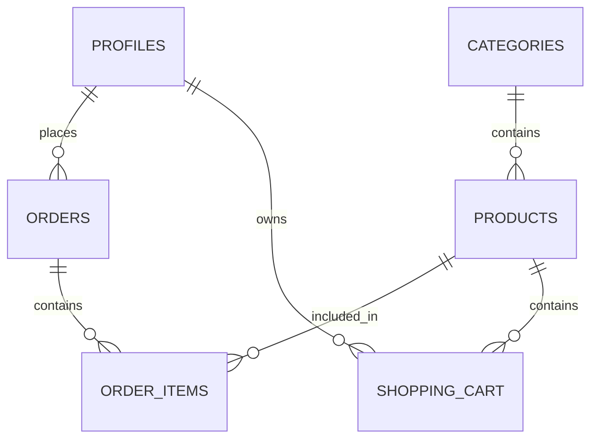

# 攀岩装备系统数据库设计文档

## 📋 数据库概览

本系统采用 PostgreSQL 数据库，通过 Supabase 提供服务。数据库设计遵循第三范式，包含完整的攀岩装备电商系统所需的所有表结构。

## 🏗️ 核心数据模型

### 1. 用户管理 (User Management)
- **profiles** - 用户资料表
  - 扩展了 Supabase Auth 的用户系统
  - 支持客户和管理员角色
  - 包含完整的地址信息

### 2. 产品管理 (Product Management)
- **categories** - 产品分类表
- **products** - 产品主表
- **product_images** - 产品图片表（规划中）

### 3. 订单管理 (Order Management)
- **orders** - 订单主表
- **order_items** - 订单项详情表
- **shopping_cart** - 购物车表

### 4. 系统管理 (System Management)
- **settings** - 系统配置表
- **discounts** - 折扣优惠表

## 📊 ER 关系图



## 🎯 产品分类体系

### 攀岩板 (Climbing Boards)
- 室内攀岩训练板
- 不同角度和尺寸
- 专业训练设备

### 岩点 (Climbing Holds)
- 各种形状和难度的攀岩点
- 丰富路线设计选择
- 按难度分级

### 复合板 (Composite Boards)
- 多功能复合训练板
- 集成多种训练功能
- 综合能力提升

### 五金配件 (Hardware)
- 攀岩相关五金配件
- 安装工具和材料
- 专业级配件

## 🔧 数据库特性

### 行级安全 (RLS)
- 所有表都启用了行级安全策略
- 用户只能访问自己的数据
- 管理员拥有全部权限

### 自动时间戳
- 自动维护 `created_at` 和 `updated_at` 字段
- 使用触发器实现

### 业务逻辑触发器
- 订单确认自动更新库存
- 订单取消自动恢复库存
- 自动生成订单号

### 性能优化
- 关键字段建立索引
- 分页查询优化
- 复合查询支持

## 📁 文件说明

### schema.sql
原始数据库结构文件，包含基础表结构。

### enhanced_schema.sql
增强版数据库结构文件，包含：
- 完整的攀岩装备分类
- 增强的产品表结构
- 购物车功能
- 系统设置管理
- 折扣优惠系统

## 🚀 迁移指南

### 1. 全新安装
```sql
-- 在 Supabase SQL 编辑器中执行
\i database/enhanced_schema.sql
```

### 2. 从现有系统升级
```sql
-- 备份现有数据
CREATE TABLE backup_products AS SELECT * FROM products;
CREATE TABLE backup_orders AS SELECT * FROM orders;

-- 执行增强脚本
\i database/enhanced_schema.sql

-- 数据迁移（如果需要）
-- 具体迁移脚本根据现有数据结构调整
```

### 3. 开发环境重置
```sql
-- 完全重置（谨慎使用）
DROP SCHEMA public CASCADE;
CREATE SCHEMA public;
\i database/enhanced_schema.sql
```

## 🔍 常用查询示例

### 产品查询
```sql
-- 获取某分类的所有产品
SELECT p.*, c.name as category_name 
FROM products p 
JOIN categories c ON p.category_id = c.id 
WHERE c.slug = 'climbing-boards' AND p.is_active = true;

-- 库存预警
SELECT * FROM low_stock_products;
```

### 订单查询
```sql
-- 获取用户订单历史
SELECT * FROM order_details WHERE user_id = 'user-uuid';

-- 销售统计
SELECT 
    DATE_TRUNC('month', created_at) as month,
    COUNT(*) as order_count,
    SUM(final_amount) as total_revenue
FROM orders 
WHERE status NOT IN ('cancelled', 'refunded')
GROUP BY month
ORDER BY month;
```

### 业务分析
```sql
-- 热销产品
SELECT 
    p.name,
    p.sales_count,
    p.view_count,
    c.name as category_name
FROM products p
JOIN categories c ON p.category_id = c.id
ORDER BY p.sales_count DESC
LIMIT 10;

-- 用户购买行为
SELECT 
    u.full_name,
    COUNT(o.id) as order_count,
    SUM(o.final_amount) as total_spent,
    AVG(o.final_amount) as avg_order_value
FROM profiles u
JOIN orders o ON u.id = o.user_id
WHERE o.status = 'delivered'
GROUP BY u.id, u.full_name
ORDER BY total_spent DESC;
```

## ⚠️ 注意事项

### 数据完整性
- 所有外键约束都已设置
- 价格和数量字段有范围检查
- 状态字段使用枚举约束

### 性能考虑
- 大表查询时使用索引
- 分页查询避免全表扫描
- 定期清理过期数据

### 安全考虑
- 敏感操作需要管理员权限
- RLS 策略保护用户数据
- API 密钥安全存储

## 🔄 定期维护

### 数据清理
```sql
-- 清理过期的购物车项目（30天前）
DELETE FROM shopping_cart 
WHERE updated_at < NOW() - INTERVAL '30 days';

-- 清理过期的折扣码
UPDATE discounts 
SET is_active = false 
WHERE valid_to < NOW() AND is_active = true;
```

### 性能优化
```sql
-- 重建索引
REINDEX DATABASE your_database_name;

-- 更新表统计信息
ANALYZE;
```

## 📚 相关文档

- [Supabase 官方文档](https://supabase.com/docs)
- [PostgreSQL 官方文档](https://www.postgresql.org/docs/)
- [Next.js 与 Supabase 集成](https://nextjs.org/docs)

## 🤝 贡献指南

1. 数据库变更必须先在开发环境测试
2. 所有迁移脚本都需要向后兼容
3. 新增表或字段需要更新类型定义
4. 性能敏感的查询需要添加索引 